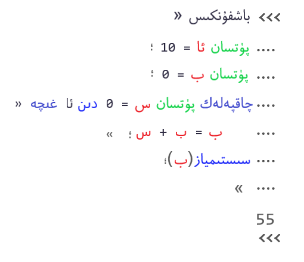
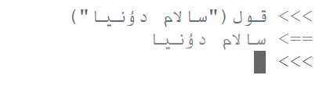

# 想法集合

> 1）记录计算机科学与技术学习道路上，想要实现或者想要试试的各种想法，不保证其可行性。
>
> 2）由于能力与知识面有限，若有错误或不符现实的，请自行忽略。（意思就是大佬饶命。。。）
>
> 3）如果你也有相同的想法，或者有感兴趣的内容，可以跟我交流交流哦~ （给个star就更好了，哈哈哈哈哈哈哈）。

## 基于维吾尔文的编程语言的实现

* 通过学习编译原理和相关技术，实现基于维吾尔文的编程语言
* 该语言编译器支持对用维吾尔文编写的，符合该语言语法规则和语义规则的代码程序进行编译，并产生目标机器上可运行的目标代码。
* 对语言的其他特性，以后做详细介绍。
* 可参考文言文编程语言，易语言等其他编程语言的实现。

1）下面是该语言简单程序代码演示：

 

* 注：图片中相关编程规则为假设，实际语言不一定与上图相同。
* 其中，可用c语言解释该上图中所用到的保留字，其对应关系如下：
  *  main  باشفونكىس
  * int  پۈتسان
  * for  چاقپەلەك
  * printf  سىستىمياز

* 上述代码在python中的代码演示：

```python
a = 10
Sum = 0
for b in range(a):
    Sum = Sum + b
print(Sum)
```

2）局限性概述：

* 维吾尔文（下文都指以阿拉伯字母书写的维吾尔文）书写顺序是从右往左，数学表达等相对与从左往右书写的文字较难，以至于现有编辑器，代码编辑器等都无法满足其正常书写。
* 每个事物的存在都应该有其他事物无法替代或无法胜任的特性。因此，该语言也同样需要新的思想，新的出发点，去研究和实现。

3）同类程序语言展示：

* 阿拉伯文编程语言قەلب书写的HelloWorld程序：

 
 
* 维吾尔拉丁文版简单项目：https://github.com/kompasim/UyghurScript


